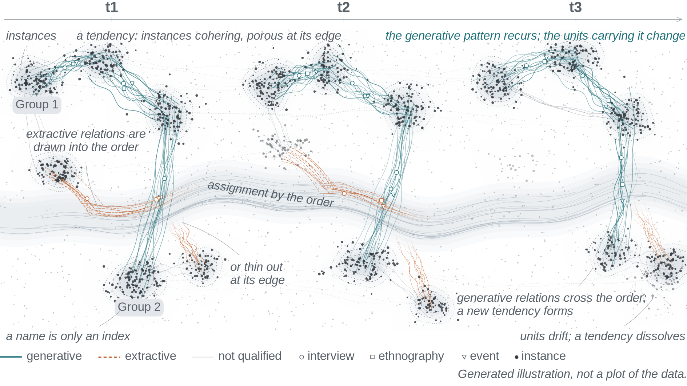

# Figure 3.y: Operationalising relations

A generated field, not a diagram. Nothing in it is drawn as a finished
shape, so the image behaves the way the method describes relations:

- **Instances** are thousands of small dots.
- **Tendencies** are wherever instances cohere. Their edges are density
  contours: dashed, open, layered. They form and dissolve with the instances,
  and nobody draws them. Names hang on as grey tabs, an index only.
- **Relations** are bundles of individual traces that pinch where they leave
  and enter a tendency and fray in between. Each trace is one trace of the
  relation. Generative is teal and solid, extractive is orange and dashed,
  not qualified is faint grey. Small marks along the qualified bundles stand
  for interview, ethnography and event evidence.
- **The assignment by the order** is a pale current that winds through the
  whole field. Generative relations cross it, and new tendencies gather on
  the far side. Extractive relations are drawn into it and follow it, or thin
  out at its edge.
- **Time** runs left to right through three moments (t1, t2, t3). Faint
  dotted trajectories carry each tendency through them. The configuration
  drifts, one tendency dissolves, an older one disperses and a new one forms,
  while the chain of generative relations recurs. What persists is the
  function, not the units.



## Files

| File | Use |
|---|---|
| `output/fig3y_operationalising_relations.pdf` | vector, for LaTeX (the density halo is embedded as an image) |
| `output/fig3y_operationalising_relations.svg` | vector, editable; text kept as text |
| `output/fig3y_operationalising_relations.png` | 300 dpi raster, for Word |
| `make_figure.py` | regenerates all three |

```bash
pip install -r requirements.txt
python make_figure.py            # writes into ./output
```

Print size 16 × 9 cm (1600 × 900 px design canvas, 1 px = 0.1 mm). Text is
8 pt or larger, in Liberation Sans, which has the same letter widths as
Arial. Every random element is seeded, so each run gives the same image. To
get a different field with the same structure, change the seeds in
`compose()`.

The colours match the relevance, qualification and significance figure.
Function is carried by both colour and dash, so generative and extractive
stay distinct in greyscale.

## Caption

> Figure 3.y. Operationalising relations. Instances (dots) cohere into
> tendencies whose edges emerge from their density and stay porous; names
> serve only as an index. Relations are bundles of traces, qualified by the
> function they carry, generative (teal, solid) or extractive (orange,
> dashed), on the evidence of interviews, ethnography and events; some stay
> unqualified (grey). The assignment by the order runs through the field as a
> current: generative relations cross it and new tendencies form, extractive
> relations follow it or thin out at its edge. Across three moments the units
> drift, dissolve and form while the generative pattern recurs: what must
> persist for a claim to hold is the relational function. Generated
> illustration, not a plot of the data.

## Alt text

> A continuous field read from left to right across three moments, t1, t2 and
> t3. Thousands of small dots are instances. Where they cohere, faint dashed
> contour lines emerge around them as tendencies, whose edges stay open.
> Between tendencies run bundles of fine, fraying traces: teal solid ones for
> generative relations and orange dashed ones for extractive relations, each
> dotted with small marks for interview, ethnography and event evidence, and a
> few faint grey ones that are not qualified. A pale current, the assignment
> by the order, winds through the whole field. Teal traces cross it and new
> tendencies gather on the far side; orange traces are drawn into it and
> follow it, or thin out at its edge. Across the three moments the instances
> drift, one tendency dissolves and a new one forms, while the same chain of
> generative relations recurs.

The alt text is also stored in the metadata of the SVG, PDF and PNG.

## LaTeX

```latex
\begin{figure}[tbp]
  \centering
  \includegraphics[width=16cm]{fig3y_operationalising_relations.pdf}
  \caption[Operationalising relations]{Operationalising relations. Instances
    (dots) cohere into tendencies whose edges emerge from their density and
    stay porous; names serve only as an index. Relations are bundles of
    traces, qualified by the function they carry, generative (teal, solid)
    or extractive (orange, dashed), on the evidence of interviews,
    ethnography and events; some stay unqualified (grey). The assignment by
    the order runs through the field as a current: generative relations
    cross it and new tendencies form, extractive relations follow it or thin
    out at its edge. Across three moments the units drift, dissolve and form
    while the generative pattern recurs: what must persist for a claim to
    hold is the relational function. Generated illustration, not a plot of
    the data.}
  \label{fig:operationalising-relations}
\end{figure}
```
